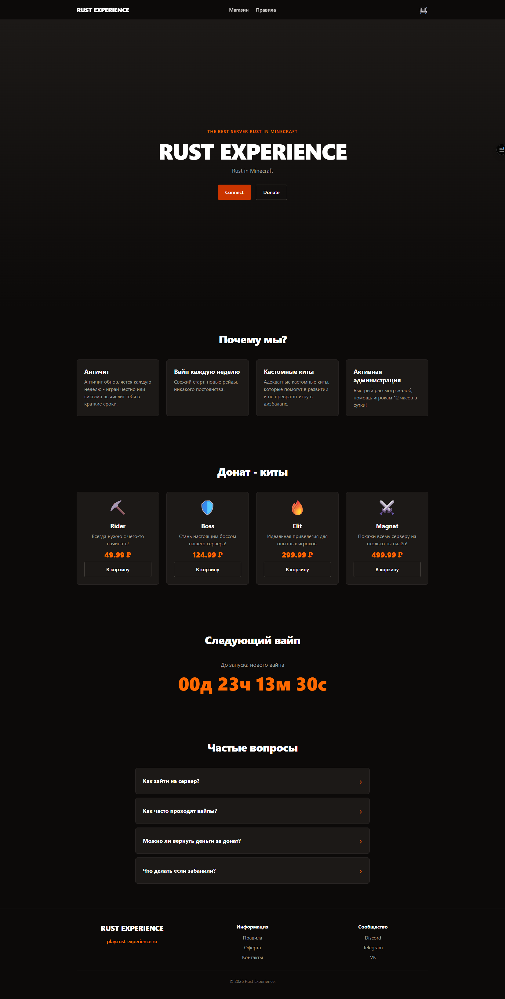

# Rust Experience

🌐 **Live demo:** [experience-rust.vercel.app](https://experience-rust.vercel.app)

Промо-лендинг и каталог донат-китов для Minecraft-сервера в стилистике игры **Rust**. Тёмная палитра, плакатная типографика, акценты ржавого оранжевого.

> 🚧 **В активной разработке.** Главная, корзина с localStorage, React Router и деплой на Vercel — готово. Дальше — наполнить страницы `/shop` и `/rules`, заменить emoji-иконки на нормальные, добавить картинки и мета-теги.

---

## 🌐 Демо

[experience-rust.vercel.app](https://experience-rust.vercel.app) — задеплоено на Vercel, автодеплой при пуше в `main`.

## 📸 Превью



---

## ✨ Что внутри

- **Hero-секция** с тёмным градиентом, плакатным заголовком и парой CTA-кнопок (primary + secondary)
- **"Почему мы"** — 4 карточки фичей в адаптивной сетке (1 / 2 / 4 колонки)
- **"Донат-киты"** — 4 карточки товаров с иконкой, названием, описанием и ценой
- **Модальные окна** для каждого кита — управление состоянием через `useState`, закрытие по клику на overlay/крестик/Escape
- **Кастомная типографика** — Russo One через Tailwind v4 `@theme`
- **Mobile-first адаптив** — все секции реагируют на ширину экрана через `sm:` / `md:` / `lg:` префиксы Tailwind

---

## 🛠 Стек

| Слой      | Технология                                                |
| --------- | --------------------------------------------------------- |
| Фреймворк | **React 18** + функциональные компоненты                  |
| Язык      | **TypeScript**                                            |
| Стили     | **Tailwind CSS v4** (с `@theme` и адаптивными префиксами) |
| Сборщик   | **Vite**                                                  |
| Линтер    | ESLint                                                    |

В планах: React Router, localStorage для корзины, fetch для имитации API.

---

## 🚀 Запуск локально

```bash
# 1. Клонируй репозиторий
git clone https://github.com/FullvarFront/experience-rust.git
cd experience-rust

# 2. Установи зависимости
npm install

# 3. Запусти dev-сервер
npm run dev
```

Откроется на [http://localhost:5173](http://localhost:5173).

### Доступные скрипты

| Команда           | Что делает                          |
| ----------------- | ----------------------------------- |
| `npm run dev`     | Запуск dev-сервера с HMR            |
| `npm run build`   | Production-сборка в папку `dist/`   |
| `npm run preview` | Локальный preview production-сборки |
| `npm run lint`    | Прогон ESLint                       |

---

## 📁 Структура

```
src/
├── components/
│   ├── Hero.tsx           # Главный экран с заголовком и CTA
│   ├── Features.tsx       # Секция "Почему мы" + список карточек
│   ├── Feature.tsx        # Одна карточка фичи (с props)
│   ├── DonateKits.tsx     # Секция магазина + список карточек
│   └── DonateKit.tsx      # Одна карточка кита с модальным окном
├── App.tsx                # Корневой компонент, склеивает секции
├── main.tsx               # Точка входа React
└── index.css              # Tailwind v4 + кастомные @theme переменные
```

---

## 🗺 Roadmap

- [x] Hero-секция с адаптивом
- [x] Секция "Почему мы" с компонентом `Feature` и `props`
- [x] Секция "Донат-киты" с модалками через `useState`
- [x] Секция "Дата следующего вайпа" с таймером (`useEffect`)
- [x] FAQ (раскрывающиеся вопросы)
- [x] Футер
- [x] Корзина в `localStorage` (drawer + Header с бейджем)
- [x] Заглушка формы оплаты
- [x] Деплой на Vercel
- [x] React Router и переходы между страницами
- [ ] Наполнить страницу `/shop` каталогом всех китов
- [ ] Наполнить страницу `/rules` текстом
- [ ] Заменить emoji-иконки на SVG/Lucide
- [ ] Картинки в hero и мета-теги для превью ссылки

---

## 👤 Автор

**Дмитрий Рябинин** ([@FullvarFront](https://github.com/FullvarFront), [Telegram](https://t.me/failgen))

---

_Pet-project для портфолио. Не для коммерческого использования._
